# 👑 Admin ERD & Database Schema Specification

> **Subsystem Scope:** Administrative control center, RBAC permissions, audit trail, e-commerce catalog, 3D interactive viewer templates, print substrates, inventory reorder thresholds, VIP loyalty tiers, coupons, and financial reporting.

Direct Diagram Link: [**Open Admin ERD in Draw.io**](https://app.diagrams.net/?grid=0&pv=0&border=10&edit=_blank#create=%7B%22type%22%3A%22mermaid%22%2C%22compressed%22%3Atrue%2C%22data%22%3A%227Vxrc%2BI2F%2F41zKQf6BDY7bYfCZcs70KgQNJtv3iELUCNbbmyncv%2B%2Bp6jiy0uiWXvdtrsvLOZtSXDY1k610fHUDFkZCdI1Or0W91O8Xe7Gi1XePphAH%2FtNm99uILmat0fj73Fcj6eTEfyek99rXv546UXkZjsaAotN7R1f%2FXpCKTrkTRlu9gdpH87nKy96fz6CKnnhXyXesTPGI9P0Y6a8EjD28HaG%2FTXo%2Bv5cjI6cyf9mYP7dOGxfR5nhJ0bsv2Ns1jeXX856d8cY3a9PUm9ByIYibNauIPb1Xo%2Bm%2FzRX0%2FmN956NFtM4YmO4Hs45C3b5YKmXi%2FQ%2BMe3mNxUTQd%2BYgL3OIDv4YyQjO64YF%2FOCcPR9w5BJzd3o5v1fPm7N4Nbw9xMj8C7XiaIf596gjx6acb9%2B9M7vAByeCdzyYMJG3w6EaAezJKgPhdB6kX8gUa0XInDu91NFt56clY2l6Pf%2BsvhAe47mJ48DmHcZ6ZmOFkN5rc35xZ2vhzqW5RIoCxJEjJYxIxXSngJoIHlsYA%2BXcj3r4r2CZyRiv7vs9GRQL%2BHkeq5dAMaqEWcTwajI6Cet6MxFSBf5xejNBJXx9Nh%2FW3YjsUZnLAAh%2FypMGHYEiwi4hnOPtHnM7Nq%2FaWZYPEOTmISUYUxzsMQzm5kh9N385QK%2Ff1bPZB%2BEDEwWZ2PJA5CVxwaERZaIPPtlvmMYNdIXXoNhsZ5BAfBQ%2F0gaZ7ANOuBqBU5bCljL16H%2FTNF29sBqIiBXecoSYh%2BLUich0Sgjlz1EW5G4EGeXkfbcBgeQcDskXtbMO1ceDQmm5AGCrc7xi%2BvqJ8LluEajkOyc5xA8kAyOSJcAXN%2Bu5y%2B%2FvWMRTTNSJTAuS8oCGbgkUyhDFQbGuvyU65geRIcgN2qdgXYh%2BGpTpw67UbK0a2nHAUMCrgnscYaa0m3VNDYRx3uKK3Teuso6UnInylVoEbeV%2Btxu9vp%2FtTudC4dgQKaEJGhZVcQC0ETcIlpIePwuHGmPqs6xixm6d7umcQP8H0u50T1%2FDpwvH3CU6aCE6mvqG8AVOCsaMxkc0gxIqLi4A6dKSWB440eubgHgSnv1ZcxlhSmGfHheVDpV%2BYTTpgwC1s9bTMuYtV58VN%2F1u4uZj8UQ%2B1vMzBvXN74Aq60Lzv25Ru222euSs9UNPegLVTfnM%2Fj9jB31PY3oK5FVNxIS3utb6WllpCAaGy3rSa6mrHMeJQ1Se%2FldGRVPi2jTzikgKa%2BYEkptkMGUQQuuvIiP7VQ%2FeBWuYzxz8QW9p%2F2cIkApVK%2BAT4f8sdCFiMaMPkR1dyDaBaNXOyklXC4ASpart1cQuPANhYs9hLBdwc2xudgzqgSFd1DwDSG0qe5Sl%2BQUw%2FlTc8TmIZQKXUDSS4GVMiysnpNNeM%2FqmaHeWMjXXvX%2Bma65ivLX1%2FBTH4rZ3Y5gqSmkKPbxdBuDkfTkdUcfV7Ml2tXlwtuMHv2sudEi9hC8ADUrkCbi8ByUEOW%2BjyPy8sQ3VEhg1GnCdK3YzqqWxNQP%2BxfyiQCTiZDp7iThwFk0WGuDQY6%2BAfGpXait6swQxokpo8HIDMesC0zdrEKpJhClngkCIzqw2JB4iYfdrJorkv9PGBZA%2BF%2Fge6orwTdb5AzDRRbgF9XeVPnop9AZEZBXKQ0wTfuH6GtmivwSpB5%2FOAaqIQ5HkyYaN1sJa80cUQ2SB6pR3cTAv8MxER1VueMav5TLjKPG31Dr5gmIZFjoX%2FlGFZ%2FbUB1x1K2YaH0km%2Fcyh8wZU3Eu2nWoymw51cyH607Z1SxpgLNSJpJaSitcg0C4khBSoxq%2FSgx7nMLohjP6tMt%2FH%2BxWA7b69VHzMwqtDagPkw1chYbklIIlpivn%2FEK2mopZM%2Fi48IVCeMZMB4gTDbeCoZ%2BT7O94LmM85yBS%2BImZlo8E0YVrPR1KS393iavZnAsVgOZTY%2FZGWW3ayeYa%2FyAunt1qqOtBVKk3l85kS5VQa55JmfmN5iWPbhDlf2dpVJPASFkVryrR0IKlsjo6JIam7Teg5fbg%2B91fW4ku3sBrA54Z%2Fqo4Hrg4SG6BzkqTFT1Ix%2BYNj%2BHYUbsC9JDCnNgerQl74fwMFVhtg7rcWQQtZURECTAolzoKC%2Bj%2FCyP4JZlNJTxrJSOxKLQduGmON%2BGpCK%2FKAQv4gENccJyEaqxXE%2FXY3mG%2F19PJb2NH8JJY%2FLpK3msAn1LwnAj5TACL6vwu7gYY32hhXFYHFRRf5YC2tOOQRCPbU08XpVVLvw9RnytOtpop12lU5NTGwiyLVeKADpcrZFc%2Fbdd28EWUiMX15QySJSneNXDdVu2D3ZaSb3t5R36FHAl7avpp%2FZnVzlO2Rdj6tXZxeeVDiDVYaYOU3X4rI%2Fdz1PXyNLnIReeFcdiGxHJRqreBWQ9UvOvQlCbeqh7%2BqRAP8qTAWgzIra6vcs%2B%2FnP2o1LRQOn%2BBC0rmc47Ncet0u%2FNt1vluCpV7mW%2FUqLaTmtKH2hF4lfSRXuwnTFhYWnbrKHuOe5zVduylyPcB4AmJrT9PujCV3Z8G1mDpqTGP2QNMmT7YWosPZOhwVr3t2rFugkS%2Bl4EcR%2FX3MJQeU5FmNwpocg2Fhu3yjchzIZJ%2FhR3Em0EZ%2BACKybHbH%2FhXTEM8SDgItpJXfHckIN%2F8FiRCx%2BuHlmQ7ZUl2lNFjuP5kzo8q8MXFASXGxMMcOSNt1xuX0slSGCppAPsjHVvXwji9ijKOiUQ%2BmUZPQWcxBgeKJt1pzkTNzsVkScv9UlYpDRPLJKB1x%2Bc42GlrjmCsfgAjMW1wUobIifR01QARs%2Fq7DhsqROdKkgZYJk5FBnu0qAQJiEngROgUjycORydF9J4l%2B2L%2BcMxQhwF9o%2BKimV4A2bubD1KffvW%2B7Z8VUlUoZ2Az6rCBMlaURCy9N9kqYZ2x9cxQisdXX8XQlSWHjWRn3%2BQENLCeSLpNeWzkETZHLf0PjYcJ%2BBNW7UcJoNveL6KPguGaHlTY5N9I0isfe2MxDlWbeRCc5c4tit13T3zNVhmR6GzghN3RyOJJZ%2BnWpg0r1QOTd1poD5Qg2YCgbjPEy%2BhwofQt0idZ7IboQ4vvHfFTWkYwpjsjHlJM1XrU5%2B0CuiW5KFkwqoCIR3%2BgCrT%2F9sP9fdSYWETO9I868aVk3r5miVRobZl7twUTGvVscrD47bvJnXUvkCyaepCZZ1d0wHb6vEtiCxJc6ERQX5lbKNlVfAwLFv3JSOX%2BGV3VJGL2ryVgAnNTJWplEPV1ZJFJx%2BVYXNgTktMoVhSiNUejCVbkS2V6WjJoC44q6o2KCHlzJQG7VbR0gvBYfxUp%2Fyu5qyMR3JZWWrTGyvdJZcPDVCFPp%2Bl5jAwN9Mpl6Ogk4uegJp6iDduLV6oMG5kLZpm5YUavmYr0BSdNW0OvLikjTaYcRZvMLctFlQzA0j%2B%2BjxO88jKrsEMkKRo2TSVm%2FAbAsrz9yTemTLQIQ0zAqe%2FFvSUa2wQYu2NR7aZ2V1dYl2tLm%2B7UpcdxV6YSfZirrAW8%2FZlp9PtyRZ62%2F%2FNr%2BrWLIJKQ0ShtUmbns5ML0ILjQhJq4zqa7oz5bsGon5YA19fwN81Tssyy0gZb3UlePyl5P9XLHywtmOu5c6UqfAMIX%2BXkuyw81Xa7CWRRIemNjsXl5o8VoeeOrxzJmklX5EU7OwK68ZaBxtpsK5%2F5UxIAa8RlCboSFIvgpCPGeONgii7UXDsCxf0x92PLSxCev%2FkPPRAl%2FqcBL79PONIm%2Fmtw3qgqshXZ7MAZ6R8DBEogtAQgknxbNLrgPnaMC9pojqXeYr8x685zV211NekvUwFAjl4w%2BMPQpK%2B%2FZjVegelkWI2zXcfWOJJ5TzyPIUYK523LEfdgtIlfSRCTUllSam13geBbYFxx3N%2FL9VA7bU0IVwKsCsa060Mw5wDXR3cK30V5SzZ2lpOnoNjFnIwllt%2BKJ5Q7ziDWnkpwWLPok8uWJ7sBAnKTvqUYNmayhlr2wVZOqdGMOMxBI5SjrTOvW9pnrhBKHm0y8ti01E9zX5IWJR6pU0qSiKkdrWk7rPoO4hBD98oa6L%2FNfPUlxQN8pEIwyCzk7m6nc1GSwx%2BXClSm4CNEsJ2bkVzWh1KPTh0VEoV2FPVWpeSbQm05dccpPjU3xterNifMJ5fa7qO6WqxUE9eYHtbayfFGu1ABt2VuLZMwlFkVpE5PDAL1D7qCi81k3R43POYo7iG7piyalhTL2SRqcu6DvlGzsqSBjQyhlo%2BuyuaNZFl7m%2BMRQlbESZUE2RSPUwBzPdBllkvdta3O%2B8bJwSKXwGl30hfV7wOuRyaVKsq17K413yT6bWGryB7LkvHy946ZYgHVVAWrNzOPt5NXNe%2FQbpnSYJM8ZYaxkb3QGtMa1ZNFv7bGqllQCD8Lt66qQNroV3rjQHnRz3zgs25F2qgw4e2%2Fd5NoFKH%2Bu%2FYlIUD5FmyHDZjfj0gafmK0Iw8k6IxUHGgbswrdutP7vLaO0Tg%2BUpoQbd5HNSJU5KQ%2BJZ6m%2Fc2Ftit3c3Q%2FaUGCA2pj%2BYiKJIzRC1e2ChzNgfUt2LTvmoD8X3jhEoZtpd5PGUyjdX9N2t2DKzFHcckSfdcE9MNatRlLeAhkCwud%2Fs2DZWUWjWBugtxZGc9IIs1sJA0cVAdWxyWzeld2fpk5beqkD8pye1jR6uB15B7ERbQGLIy%2BaMEZlOi9tikw7AhjbuYqhccnSHfgHWxfzujkWlpuqf47UzLiSsrWPCWlQv2f29fD%2Fqrj%2B1ffr780O29c%2FL751zwzrddcGS7YFjjADfGbE%2B8IfE9%2Fn5MnG4tIsTnzrkficp8oG%2FOF8ojN4lfjp376cvAW8JC%2BlUOH0ZXyOZCzSE07qhgW2RQVbz5XXhn%2BydjGulP0122f0B%2FWPzAsXL7JJGBhzSJzM%2B%2FOIJtmMAf4KEsyYrNqKvJsiXLvs2vxCzVB%2BDs5tyvCZ3VB%2FyZFCwvTUloKhnvVBc0SgVxN%2FcA6NlKdtnVJGF%2FXQ9I%2BQ0byjiOiZpZJ5U9v4edprmlkgcBOUDX0E2FVEj%2BBJutN6mMfwM%3D%22%7D)

---

## 1. Numbered Mermaid ERD

```mermaid
erDiagram
    USERS ||--o{ STAFF_PROFILES : "1.1_manages"
    USERS ||--o{ TASKS : "1.2_assigns"
    USERS ||--o{ AUDIT_LOGS : "1.3_logs_action"
    
    PRODUCT_CATEGORIES ||--o{ PRODUCTS : "2.1_contains"
    PRODUCTS ||--o{ PRODUCT_VARIANTS : "2.2_has_variants"
    PRODUCTS ||--o{ CUSTOMIZATION_TEMPLATES : "2.3_configures_3d"

    PRINT_CATEGORIES ||--o{ PRINT_ITEMS : "3.1_categorizes"
    PRINT_ITEMS ||--o{ INVENTORY_MATERIALS : "3.2_tracks_raw_stock"
    INVENTORY_MATERIALS ||--o{ MATERIAL_STOCK_LOGS : "3.3_records_movements"

    VIP_TIERS ||--o{ REWARDS : "4.1_unlocks"
    DISCOUNTS ||--o{ ORDERS : "4.2_applies_to"
    
    ORDERS ||--|{ ORDER_ITEMS : "5.1_contains"
    ORDERS ||--o{ PAYMENTS : "5.2_records"
    ORDERS ||--o| INVOICES : "5.3_generates"

    USERS {
        bigint id PK "1.1 Primary Key"
        string name "Full Name"
        string username UK "Admin Handle"
        string email UK "Official Email"
        enum role "superadmin | admin | manager"
        json permissions "Granular RBAC Matrix"
        boolean two_factor_enabled "2FA Security Flag"
        string avatar "Avatar URL"
        timestamp created_at "Created Timestamp"
        timestamp updated_at "Updated Timestamp"
    }

    STAFF_PROFILES {
        bigint id PK "1.2 Primary Key"
        bigint user_id FK "References 1.1 USERS"
        string employee_id UK "STF-2026-001"
        string department "Prepress | Printing | Finishing | Inventory | QC"
        string position "Operator | Senior Designer | QC Lead"
        string workstation "Assigned Machine Station"
        string shift "Morning (6AM-2PM) | Afternoon (2PM-10PM) | Night"
        boolean is_active "Active On-Duty Flag"
        timestamp created_at "Created Timestamp"
        timestamp updated_at "Updated Timestamp"
    }

    TASKS {
        bigint id PK "1.3 Primary Key"
        bigint user_id FK "Assigned Staff 1.1 USERS"
        string title "Task Title"
        text description "Directives & Instructions"
        enum priority "low | medium | high | urgent"
        enum status "pending | in_progress | completed | cancelled"
        timestamp due_date "Deadline Timestamp"
        timestamp completed_at "Finished Timestamp"
        timestamp created_at "Created Timestamp"
        timestamp updated_at "Updated Timestamp"
    }

    AUDIT_LOGS {
        bigint id PK "1.4 Primary Key"
        bigint user_id FK "Actor 1.1 USERS"
        string action "CREATE | UPDATE | DELETE | EXPORT"
        string entity_type "Product | Order | Discount | Material"
        bigint entity_id "Target Record ID"
        json old_values "Previous State"
        json new_values "Modified State"
        string ip_address "Client IP"
        timestamp created_at "Audit Timestamp"
    }

    PRODUCT_CATEGORIES {
        bigint id PK "2.1 Primary Key"
        string name "Category Name (Apparel, Drinkware, Signage)"
        string slug UK "Category Slug"
        text description "Category Summary"
        string icon "Category Icon Name"
        int sort_order "Display Sequence"
        boolean is_active "Active Visibility"
        timestamp created_at "Created Timestamp"
        timestamp updated_at "Updated Timestamp"
    }

    PRODUCTS {
        bigint id PK "2.2 Primary Key"
        bigint category_id FK "References 2.1 PRODUCT_CATEGORIES"
        string name "Master Product Name"
        string slug UK "Product Slug"
        string sku UK "Master SKU (PRD-TSH-001)"
        decimal base_price "Base Price PHP"
        decimal compare_at_price "Strikethrough Price PHP"
        string unit "piece | set | bundle"
        boolean track_inventory "Inventory Tracking Flag"
        int stock_quantity "Total Warehouse Stock"
        int low_stock_alert_at "Reorder Threshold"
        boolean has_3d_preview "3D Interactive Flag"
        boolean is_customizable "Customization Allowed"
        enum viewer_type "shirt | mug | tumbler | tote | pin | glb | flat"
        string model_3d_url "GLTF / GLB Model File URL"
        string fallback_image "2D Fallback Render"
        decimal customization_addon_price "Customization Surcharge PHP"
        string status "active | draft | archived"
        timestamp created_at "Created Timestamp"
        timestamp updated_at "Updated Timestamp"
    }

    PRODUCT_VARIANTS {
        bigint id PK "2.3 Primary Key"
        bigint product_id FK "References 2.2 PRODUCTS"
        string variant_sku UK "SKU-BLK-XL"
        string size "Size (XS, S, M, L, XL, 2XL)"
        string color_name "Color Label (Matte Black)"
        string color_hex "Hex Code (#1A1A1A)"
        decimal price_adjustment "Variant Price Offset PHP"
        int stock_quantity "Variant Inventory Level"
        string thumbnail_url "Variant Photo URL"
        boolean is_active "Availability Flag"
        timestamp created_at "Created Timestamp"
        timestamp updated_at "Updated Timestamp"
    }

    CUSTOMIZATION_TEMPLATES {
        bigint id PK "2.4 Primary Key"
        bigint product_id FK "References 2.2 PRODUCTS"
        string template_name "3D Template Name"
        string print_method "DTF | UV Flatbed | Sublimation | Embroidery"
        json printable_areas "Bounding Zones {width, height, x, y, z}"
        json allowable_fonts "Approved Fonts Array"
        json color_palettes "Approved Ink Hex Values"
        decimal max_scale "Maximum Zoom Scale"
        decimal min_scale "Minimum Zoom Scale"
        boolean allow_text "Text Customization Flag"
        boolean allow_images "Artwork Upload Flag"
        int max_text_length "Max Characters"
        timestamp created_at "Created Timestamp"
        timestamp updated_at "Updated Timestamp"
    }

    PRINT_CATEGORIES {
        bigint id PK "3.1 Primary Key"
        string name "Category (Apparel Substrates, Decals)"
        string slug UK "Category Slug"
        text description "Description"
        boolean is_active "Active Status"
        timestamp created_at "Created Timestamp"
        timestamp updated_at "Updated Timestamp"
    }

    PRINT_ITEMS {
        bigint id PK "3.2 Primary Key"
        bigint category_id FK "References 3.1 PRINT_CATEGORIES"
        string name "Substrate / Print Item Name"
        string item_code UK "PRN-001"
        string brand "Manufacturer / Brand"
        string model "Material Series"
        decimal base_cost "Base Manufacturing Cost PHP"
        decimal markup_percentage "Markup Percentage %"
        decimal selling_price "Retail Price PHP"
        string default_print_method "DTF | UV | Screen"
        boolean is_active "Active Status"
        timestamp created_at "Created Timestamp"
        timestamp updated_at "Updated Timestamp"
    }

    INVENTORY_MATERIALS {
        bigint id PK "3.3 Primary Key"
        bigint print_item_id FK "References 3.2 PRINT_ITEMS"
        string material_code UK "MAT-VIN-001"
        string material_name "Material Description"
        string unit_of_measure "meters | rolls | kg | pcs | ml"
        decimal current_stock "Current On-Hand Stock"
        decimal reorder_level "Safety Reorder Point"
        decimal unit_cost "Unit Procurement Cost PHP"
        string supplier_name "Supplier Details"
        string status "in_stock | low_stock | depleted"
        timestamp created_at "Created Timestamp"
        timestamp updated_at "Updated Timestamp"
    }

    MATERIAL_STOCK_LOGS {
        bigint id PK "3.4 Primary Key"
        bigint material_id FK "References 3.3 INVENTORY_MATERIALS"
        enum movement_type "inbound | production_consumed | scrap | adjustment"
        decimal quantity_changed "Delta Quantity"
        decimal balance_after "Remaining Balance"
        string reference_no "PO-10023 / JOB-2026-001"
        string remarks "Stock Movement Reason"
        timestamp created_at "Log Timestamp"
    }

    VIP_TIERS {
        bigint id PK "4.1 Primary Key"
        string tier_name UK "Bronze | Silver | Gold | Platinum"
        int level "Rank Level (1, 2, 3, 4)"
        decimal min_spent "Spend Threshold Required PHP"
        decimal points_multiplier "Points Multiplier (e.g. 1.5x)"
        decimal discount_percentage "Automatic Discount %"
        text perks "Free Delivery, Dedicated Rep, Rush Queue"
        string color "Badge Color Class"
        timestamp created_at "Created Timestamp"
        timestamp updated_at "Updated Timestamp"
    }

    REWARDS {
        bigint id PK "4.2 Primary Key"
        bigint vip_tier_id FK "Required 4.1 VIP_TIERS"
        string title "Reward Title"
        string code UK "Reward Voucher Code"
        text description "Reward Benefit Description"
        int points_required "Points Required"
        enum reward_type "voucher | free_sample | tier_upgrade | express_print"
        decimal discount_value "Monetary or % Value"
        string status "active | inactive"
        int claims_count "Total Times Claimed"
        timestamp created_at "Created Timestamp"
        timestamp updated_at "Updated Timestamp"
    }

    DISCOUNTS {
        bigint id PK "4.3 Primary Key"
        string code UK "Promo Code (SUMMER2026)"
        string name "Campaign Name"
        enum type "percentage | fixed"
        decimal value "Discount Value"
        decimal min_spend "Minimum Spend Requirement PHP"
        decimal max_discount "Maximum Discount Cap PHP"
        timestamp start_date "Validity Start Timestamp"
        timestamp end_date "Validity End Timestamp"
        int usage_limit "Global Redemption Cap"
        int usage_count "Current Total Redemptions"
        boolean is_active "Active Promotion Status"
        timestamp created_at "Created Timestamp"
        timestamp updated_at "Updated Timestamp"
    }

    ORDERS {
        bigint id PK "5.1 Primary Key"
        string order_number UK "ORD-2026-0001"
        decimal subtotal "Items Subtotal PHP"
        decimal customization_total "3D Customization Total PHP"
        decimal shipping_fee "Shipping Fee PHP"
        decimal discount_total "Discount Deductions PHP"
        decimal total "Grand Total PHP"
        enum status "in_progress | processing | delivered | cancelled"
        string payment_method "GCash | Maya | Card | COD"
        string payment_status "pending | paid | refunded"
        timestamp placed_at "Order Placement Date"
        string expected_delivery "Target Delivery Date"
        timestamp created_at "Created Timestamp"
        timestamp updated_at "Updated Timestamp"
    }

    ORDER_ITEMS {
        bigint id PK "5.2 Primary Key"
        bigint order_id FK "References 5.1 ORDERS"
        bigint product_id FK "References 2.2 PRODUCTS"
        string product_name "Snapshot Product Name"
        string sku "Snapshot SKU"
        string selected_size "Selected Size"
        string selected_color "Selected Color"
        int quantity "Item Quantity"
        decimal base_price "Base Price PHP"
        decimal addon_price "Addon Fee PHP"
        decimal unit_price "Final Unit Price PHP"
        decimal total_price "Total Line Price PHP"
        timestamp created_at "Created Timestamp"
        timestamp updated_at "Updated Timestamp"
    }

    PAYMENTS {
        bigint id PK "5.3 Primary Key"
        bigint order_id FK "References 5.1 ORDERS"
        string payment_reference UK "PAY-GCASH-9817234"
        enum payment_method "gcash | maya | credit_card | bank_transfer | cod"
        decimal amount "Amount Paid PHP"
        enum status "pending | completed | failed | refunded"
        timestamp paid_at "Payment Verification Date"
        timestamp created_at "Created Timestamp"
        timestamp updated_at "Updated Timestamp"
    }

    INVOICES {
        bigint id PK "5.4 Primary Key"
        bigint order_id FK "References 5.1 ORDERS"
        string invoice_number UK "INV-2026-0089"
        string bir_receipt_no "BIR Official Receipt No"
        decimal vatable_sales "Vatable Amount PHP"
        decimal vat_amount "12% VAT PHP"
        decimal total_amount "Total Invoiced PHP"
        string status "issued | paid | void"
        timestamp issued_at "Issue Date"
        timestamp created_at "Created Timestamp"
        timestamp updated_at "Updated Timestamp"
    }
```

---

## 2. Numbered Architecture Domains

### 1.0 Identity, Staff & Governance Domain
- **1.1 USERS**: System accounts (Superadmin, Admin, Managers) with JSON permissions matrix and 2FA tokens.
- **1.2 STAFF_PROFILES**: Personnel records with employee badge numbers, station assignments, and shift rotations.
- **1.3 TASKS**: Administrative directive dispatch with priority levels, deadline milestones, and completion logs.
- **1.4 AUDIT_LOGS**: Comprehensive system audit recording actor IDs, entity modifications, previous/new payloads, and client IP addresses.

### 2.0 Catalog & 3D Interactive Customizer Domain
- **2.1 PRODUCT_CATEGORIES**: Public & backend catalog classification with slugging and display order.
- **2.2 PRODUCTS**: Master product entities with pricing, inventory threshold flags, 3D flags, and model URLs.
- **2.3 PRODUCT_VARIANTS**: Color and size configurations with individual SKU tracking and price adjustment offsets.
- **2.4 CUSTOMIZATION_TEMPLATES**: 3D bounding areas, allowable fonts, ink palettes, and texture UV coordinates.

### 3.0 Print Operations & Material Inventory Domain
- **3.1 PRINT_CATEGORIES**: Print service classifications (Apparel Substrates, Signage, Paper, Drinkware).
- **3.2 PRINT_ITEMS**: Substrate specifications, base costs, markup percentages, and retail prices.
- **3.3 INVENTORY_MATERIALS**: Raw materials (vinyl rolls, ink cartridges, transfer sheets) with safety reorder points.
- **3.4 MATERIAL_STOCK_LOGS**: Real-time inventory audit ledger recording stock inbound, consumption, scrap, and adjustments.

### 4.0 Customer Loyalty, VIP Tiers & Marketing Domain
- **4.1 VIP_TIERS**: Tier programs (Bronze, Silver, Gold, Platinum) with spend thresholds and points multipliers.
- **4.2 REWARDS**: Claimable perks including voucher codes, free sample items, and express printing vouchers.
- **4.3 DISCOUNTS**: Promo coupon engine supporting fixed/percentage deductions, minimum spend checks, and redemption caps.

### 5.0 Sales, Orders & Financial Invoicing Domain
- **5.1 ORDERS**: High-level sales transaction records with subtotal, customization fees, shipping, and order status.
- **5.2 ORDER_ITEMS**: Snapshot line items detailing base price, customization add-on fee, and ordered volume.
- **5.3 PAYMENTS**: Gateway settlement records (GCash, Maya, Cards, COD) with verified reference timestamps.
- **5.4 INVOICES**: Official sales receipts with BIR-compliant serial numbering and 12% VAT calculations.
