# 🛍️ Customer ERD & Database Schema Specification

> **Subsystem Scope:** Storefront customer profile, address book, 3D interactive viewer customizer, shopping cart & orders, digital proof approval interface, discount codes, and VIP loyalty reward claims.

Direct Diagram Link: [**Open Numbered Customer ERD in Draw.io**](https://app.diagrams.net/?grid=0&pv=0&border=10&edit=_blank#create=%7B%22type%22%3A%22mermaid%22%2C%22compressed%22%3Atrue%2C%22data%22%3A%223Vttc5u4Fv41nsn9kI5jp%2B3uR8dOUk%2FtxGvsbLdfGBmEra1ArAA36a%2B%2FRy8g4ZAguLN3m%2B24MQjzoJdznvOiA%2BYzgvYcxYPhZDAaVp%2BH%2BcrfzK%2FXnjj9OIXP%2BTkbfLyC0%2BnW29wv9aWxumt08e7CDyjKMhIRnEHDCV7tpmY8fzKbra897%2FoEeOTHiCQ5%2FO%2BJu77%2BfbKenaCOfY5DjOMGTOv3XRAv%2FQDliLJ9gUOfJJ36er%2BePZvQ935KUdBxMlfr%2B%2Fsbf7KC74fJ4gTxA4z5SPD3ErKOCrfMttONP51srm%2Fv1%2FPrZnjxmxruSCw9e2mB7DsasfyHyXo%2BuTvFHPkHlPlHxAlK8k64anbmXyeb%2Bf2dv7lerhYwohP4sR%2FiiCQ488dh42yYFdHo8rtaK38OwDXMscs01AbbIAJNsCM%2FwxQHOUiVno7n8Cc3G%2BRpdbE2LSePGPtBkeUsJj%2FgId9JfujwhBapG4NecPxXQTjMdcoZixqnezb3pvfblyemhnkJU43SlALT%2BDl7oa9N3Zz8sbw%2BkbRLOb95TsX0EtTYubq%2BXZ1ctT87sidifYYkFM%2F7XJGjOOMkRvwJjj7jp%2Bedtj9ZzkmyhwO1LJiDZIUYzrcaceptzi%2BGw%2BGFI06CYqzv1IhwdlNQCl938poTDAYmpnY3DNi1uuQEkx5YoruzZDtCxfFdEe8EkNu0sDhFyZPuhHVyI1af71FCfqCcsAYStj84KWL4yp9S3RuShORIwgJRLTziUTxlHOW4avmO6LdGfm%2FsKjqCUeAKfsVZpEY7KVu368XrQEqccgaWxWc8xDxTWPfiWMgmK5oIwf6EOADJoxVMlmIJCnctSIRzImXDg1YptJ9WLj2i7AnR%2FMlPGZH8LNDW%2BDviEqNsvEIUJYGreB1J6ucE69kCFwQONupcCenw7Iqz5AcciYXwCD2Ki%2BL4ltHwP68%2FRowzy1GcilXlGAlCRXnZ8z2BbmiZgYdWP3VFLNKwhrhV5y1gH2cvs03dH%2BpFO6NBJ9qpYCrakXg3n8tJijDHiXRJhorTLGZ0WmGKdpgqtE8sNjp1H0UkMKe%2FI44PrMhcBYeDhKcEpNo3RLcu26SSgF0O8kEnsrNYyrq%2FC02hMASrl%2FkUHI0LheTlHGMBNFHXBiVrbRPSosaNsCMFe4U4SvbIkOBMiDMJXCEDkpdsWh4JlGWREJhFRGWj26xxdiRJoCduZZ8JRC%2BXVOoGxTJBV9r0wU1fJSNM5fmrcswYxUgoMsmEn4cKqrVyVp2Y%2Bb%2BhaN%2BfOabqfPAPk0Y9XuvDFeNBPxdFEHapdqVfULK0VueSqPWp4OrqZEWBdKUddrA5%2BFiyhzYLC91ydqHMwEh9jdXXZYtFMIYxJoltFktbuDmAjBxUd1vtokFTNtGPQdKI8FJL819axaV94Qy%2F278bCEIdvX907nBIskBYfj%2FFPIB%2Bo73WkUkBzA1TGiihGEgqCJSTANfftwgnfhS%2FA9Bv2qbfAF%2BJJTyQNJULPlVywrgiit8KXGh7PMMhCbT8rnGLGli%2BHGV6gq5QKIcx1U1TkVB486pppxP6KObloJ8RL72pV434eFDjDkeNz2llZLXHt1Ftjitei2UqjAdWBAft1LZRvBbUEGcBJ6l224QI4QTi%2BlxKo3WpnVu0zupQNRzUNXZdNTvEE1wOyDdhxbEamOK8CHTKz0CCqOFIuVJFuucoNI34MZWWPuXE3cmvqOGIaFGFWQnOlQBpZXsvJlz9wGnRQOLzQnMCuELkaHpJkrKhfZoDikic%2BYaQRlPZIkRIBCdvXtubcoS91F4s0M%2Fgu1fAWqxfgxVUVY3bLeRTqnGa33i4304%2Fnf%2Fyy2h88WsH7bVMeKW6YJWKIHdUXVvKSZYV2DgqKl1sNYBytlOCLWQK0AisEPy%2BAlv2xqAdcPCNFTrayYreyGpYWQV8Lc7%2Fh8D4J9XTF7Ld3TV11Du5ZyXlYBB7Jm8vEx2TNIUgmCrPalnsM3W0gfiTYp61OIqGtmmxt%2FTKepAnr%2FSxsTZIEathO3WGBA0Qc9Xo4Oupyc8Yz1UmTEGBe5tSGfl6YKRxa7apFhwaSwaec3n8QDKyI%2B0x79uR8v6y3TuDpBf4FXOhFadBDztqz4ozQfGDTtmdE8UwGO16YTC%2BFRbEEmW5FErv89bVV9uhDAvvrsyXXCGR8xIzLls6xJwyJc4xyIyN50FXv%2BH8wFmxP3QBNlqScxSIfPcRTKvSWLhzbp1uxA%2FUhLSnUrQO5www%2FypQkleJp8kREYp20iXWruDQE79z7ajYLxyHMHq5x6lAxzP4vk40bHv3auRQ7onpuwflfke1t%2BAAqP0K0SPwckxIkB0Il9otXYlYyqIOBBTDm3Nm7T2kJKmO93RXHUcUuab6YvC0qJiogutcyu1icyOPxN%2Fbhdgpm2SZzFK2bk9YAmjPjY%2FCEP5akjgRDWLKsJP8ucQdIUeRmUPEgwNc7eCP%2FdycXd8q7sPdHTN6FUyquPBV6h4NbOPi5uqrzWu%2FzppAludXi8%2FnX1oEzQgE%2BVGSmzo6%2B%2BLp%2FSDtLKmvhfr6or9HXxauPpPMSFk7CWU6aqE3L86uKBK0JHcqDiTX6a87dHzq9ogDflRP%2BCQPVNZjeDYYjYfyn3M2UOoZ6NyfoINxFQI9lNUCFe17BSgJ4nsnFXyZqg2wbQd0LtYthXQAlkuA8A0LWb09MLGr304%2BL7tyypZoH%2B7fkeF%2FpaylFzv0TSv%2BTeyQ4xjc%2BBxbeieN90a3D7rt3YmEmR%2BD58N0Km%2BmbJw0FdsHJRT5zgrnvWJHSexQNfBnJg2ZfIRwDXxwu5C2UCuVqBt%2BVVuHM1jjJANEdfkD%2FJWDuo8isK8t4Y5%2BDqKUfZfPiVi10w7RIWfS2A1vmHzigmQtHoDGU9STIorzHD%2BHmyfAbENFSDI%2F2NJLaw8FPfpZgEpfaYke5UQw4f94qr3DZowFJH0edyDDCnLqfB3Gwk0bdXTqxU3Ez9och1NU6Ou%2Bmj6ef2dczNs2pQyFrphKVsS8iT76FCd7UXplZm8KZA285lro8QZYzCrN6k5a466plr%2B%2FoEEmIvxEVwVUXg0M8xyI8MN5e42Wkfus2OU68BEhVi6LUwUvla1dwsGaN27BSv451YBOfoHVYb0p6Ee4dMmqbUJXR79h38LqrbV3qfK4mks7wFpotxypbV3X%2BWzKCouohu3L2g0VlXEGMpSpcevYBFPwRrhlXwJRCEVpGycYE4aehCtXM2K3U5QdKsQlekLVyVTtoemT%2B1nHp9hDFJvf9lhSROw0eFQkYdsotK3JdWoA4HF6UrjmlU9cEgoUogymp37nAF3JHrIKaWz5MwUeXoLSDHxKp2xnwiqraFU3lp2%2BU1ddeVMWcBvaLFFWoln76Y5sbEowH1NVC6wlTLvkG6G9Sk2q5llrqc1bMRhW3XEfq9E3ianI%2FWWToexRadL%2BAe%2FZ7PXr2Po12PGgKbfgWtQle218c6NTw37pV5kEqAO15k3N3WVBvJUM0E0CRzZ2A7KqUCwkHfm3%2B3D1%2BPgK5YGg6d%2Bq1v93NvhZ%2Bu1Z5rKrdS4SUsss35BEtqu6xeFahWhd7bKNWFrlBUk6jfrNkNjzNzB6sVnftJ5mM3ArX6W00eCEdN1qUlUI5Iv6dpPT%2BUT2h%2FO1BFaRkZy9B1AvrWwiJl%2Fd3cLfs%2FFQAM5Wc9ccWiwSU6nK9ptHKv8WJUcZkpdirzwOQzWtqaWTNzCsIHKFOXggiIp3ZYQoqAvzxLHaqAIW0bwfoZjQ0oQ%2FpeBXovQgU1Yqqr%2FR1x1TKBBEnmQW7XDeyi%2FeyH8tM22cuCSLGI%2F9GMGjHq15Niv58UpH7NJHFHMsPUeW%2BY%2Fm8Mkc%2FhB68tbVuuG1p14a3TcV93dodAUOExFFfpGdekArjlPtWM9wRvZJ6c1HkaOcyrfA%2FDSMrC0oDDB6FVbqJbHhamZ2peaxKnB1fF0GHGCRdTNxuey3gn1Q1wbPi4bfvXvXohEN8aAOlnyz66h2o0xGTYd%2FB5TssSowBCFr3adStFLlLSDCDndy12FYj0zW8Fw9nrsqdBGJxkkCoYxDOtNWjUyEgqVeeFi%2FejQoeVQ%2BsFtUAZKSMhEvGt21oMAZ0H3%2FV8Qq9ZcYuzPBZf%2F3BOvlcyDrsVw2zfi6xNzbLpfXa5GXcrWxdolSnCLQ9oGLm%2F%2Fsxbp6lbrasiaPbUpgnEWrlNVKCTnUrz4v8deplCVJSCx7WRb76xpfHZd38GRFAje0i%2BzL7C0S4qXE21zu5M%2FCN8%2F9UL9%2BKDbJKAlVnOGJS%2B5IMMZmHLu%2Br51ZiwzW0KckJnqot5TttNset73BZEPYFcAF5zoZokOAbdaWZWmv4pI6UOY3NWG%2FcX6x31%2FuRS%2F%2FfCLkWeKRlzgDi74mf5zfTifep%2FNff7n4OBpfOrFNU8J0H9gJ09hOmMIagwb4gZ033aHkm6%2F8XasCJ2DOPIViI9aT8nil8qd9ss2nqVhR5UVxbvkVESK0VqXskp6t5Sihd5VsrtQcDqSbRCLxOs%2Bbtc%2F%2FBQ%3D%3D%22%7D)

---

## 1. Numbered Mermaid ERD

```mermaid
erDiagram
    VIP_TIERS ||--o{ CUSTOMERS : "1.1_classifies"
    CUSTOMERS ||--o{ CUSTOMER_ADDRESSES : "1.2_maintains"
    CUSTOMERS ||--o{ CUSTOMER_REWARDS : "1.3_redeems"
    REWARDS ||--o{ CUSTOMER_REWARDS : "1.4_catalogued_in"
    CUSTOMERS ||--o{ ORDERS : "1.5_places"
    CUSTOMERS ||--o{ PROOF_APPROVALS : "1.6_reviews"

    PRODUCT_CATEGORIES ||--o{ PRODUCTS : "2.1_contains"
    PRODUCTS ||--o{ PRODUCT_VARIANTS : "2.2_has_variants"
    PRODUCTS ||--o{ CUSTOMIZATION_TEMPLATES : "2.3_defines_3d"

    ORDERS ||--|{ ORDER_ITEMS : "3.1_contains"
    PRODUCT_VARIANTS ||--o{ ORDER_ITEMS : "3.2_selected_variant"
    ORDER_ITEMS ||--o| ORDER_CUSTOMIZATIONS : "3.3_customized_with"
    ORDER_ITEMS ||--o{ PROOF_APPROVALS : "3.4_requires_proof"

    DISCOUNTS ||--o{ ORDERS : "4.1_applies_to"
    ORDERS ||--o{ PAYMENTS : "4.2_settled_via"

    CUSTOMERS {
        bigint id PK "1.1 Primary Key"
        string customer_code UK "CST-10001"
        string name "Customer Full Name"
        string email UK "Customer Email"
        string phone "Mobile Number"
        string company "Company / Organization"
        enum type "individual | corporate | walk_in"
        string avatar "Profile Avatar URL"
        int total_orders "Order Count"
        decimal total_spent "Lifetime Spend PHP"
        int loyalty_points "Reward Points Balance"
        string vip_tier "VIP Tier Name (Bronze, Silver, Gold)"
        timestamp created_at "Registration Timestamp"
        timestamp updated_at "Updated Timestamp"
    }

    CUSTOMER_ADDRESSES {
        bigint id PK "1.2 Primary Key"
        bigint customer_id FK "References 1.1 CUSTOMERS"
        string label "Home | Office | Warehouse"
        string recipient_name "Recipient Contact Name"
        string phone "Contact Number"
        string address_line1 "Street Address / Unit"
        string address_line2 "Barangay / District"
        string city "City / Municipality"
        string province "Province / State"
        string postal_code "ZIP Code"
        boolean is_default "Default Address Flag"
        timestamp created_at "Created Timestamp"
        timestamp updated_at "Updated Timestamp"
    }

    VIP_TIERS {
        bigint id PK "1.3 Primary Key"
        string tier_name UK "Bronze | Silver | Gold | Platinum"
        int level "Tier Level (1, 2, 3, 4)"
        decimal min_spent "Spend Threshold PHP"
        decimal points_multiplier "Points Multiplier (e.g. 1.25x)"
        decimal discount_percentage "Automatic VIP Discount %"
        text perks "Free Shipping, Priority Queue, Dedicated Rep"
        string color "Badge Color Class"
        timestamp created_at "Created Timestamp"
        timestamp updated_at "Updated Timestamp"
    }

    REWARDS {
        bigint id PK "1.4 Primary Key"
        bigint vip_tier_id FK "References 1.3 VIP_TIERS"
        string title "Reward Title"
        string code UK "Reward Voucher Code"
        text description "Benefit Description"
        int points_required "Points Required"
        enum reward_type "voucher | free_sample | tier_upgrade | express_print"
        decimal discount_value "Monetary or % Value"
        string status "active | inactive"
        int claims_count "Claims Total"
        timestamp created_at "Created Timestamp"
        timestamp updated_at "Updated Timestamp"
    }

    CUSTOMER_REWARDS {
        bigint id PK "1.5 Primary Key"
        bigint customer_id FK "References 1.1 CUSTOMERS"
        bigint reward_id FK "References 1.4 REWARDS"
        string voucher_code UK "VOUCH-882319"
        int points_spent "Points Deducted"
        enum status "issued | redeemed | expired"
        timestamp issued_at "Claimed Timestamp"
        timestamp redeemed_at "Checkout Consumed Timestamp"
        timestamp expires_at "Expiration Timestamp"
        timestamp created_at "Created Timestamp"
        timestamp updated_at "Updated Timestamp"
    }

    PRODUCT_CATEGORIES {
        bigint id PK "2.1 Primary Key"
        string name "Category Name (Apparel, Mugs, Tumblers)"
        string slug UK "Category Slug"
        text description "Category Summary"
        string icon "Category Icon Class"
        int sort_order "Display Sequence"
        boolean is_active "Active Visibility"
        timestamp created_at "Created Timestamp"
        timestamp updated_at "Updated Timestamp"
    }

    PRODUCTS {
        bigint id PK "2.2 Primary Key"
        bigint category_id FK "References 2.1 PRODUCT_CATEGORIES"
        string name "Product Name"
        string slug UK "Product Slug"
        string sku UK "Master SKU"
        decimal base_price "Base Price PHP"
        decimal compare_at_price "Strikethrough Price PHP"
        boolean track_inventory "Inventory Tracking Flag"
        int stock_quantity "Available Total Stock"
        boolean has_3d_preview "3D Enable Flag"
        boolean is_customizable "Customization Flag"
        enum viewer_type "shirt | mug | tumbler | tote | pin | glb | flat"
        string model_3d_url "GLTF / GLB Asset URL"
        decimal customization_addon_price "Addon Fee PHP"
        string status "active | draft | archived"
        timestamp created_at "Created Timestamp"
        timestamp updated_at "Updated Timestamp"
    }

    PRODUCT_VARIANTS {
        bigint id PK "2.3 Primary Key"
        bigint product_id FK "References 2.2 PRODUCTS"
        string variant_sku UK "SKU-BLK-XL"
        string size "Size (XS, S, M, L, XL, 2XL)"
        string color_name "Color Label (Black, White, Navy)"
        string color_hex "Hex Code (#000000)"
        decimal price_adjustment "Variant Price Surcharge PHP"
        int stock_quantity "Variant Inventory Level"
        string thumbnail_url "Variant Photo URL"
        boolean is_active "Availability Flag"
        timestamp created_at "Created Timestamp"
        timestamp updated_at "Updated Timestamp"
    }

    CUSTOMIZATION_TEMPLATES {
        bigint id PK "2.4 Primary Key"
        bigint product_id FK "References 2.2 PRODUCTS"
        string template_name "3D Template Name"
        string print_method "DTF | UV Flatbed | Sublimation"
        json printable_areas "Print Zone Dimensions & 3D Offsets"
        json allowable_fonts "Approved Font List"
        json color_palettes "Approved Ink Hex Values"
        decimal max_scale "Max Zoom Scale"
        decimal min_scale "Min Zoom Scale"
        boolean allow_text "Text Customization Allowed"
        boolean allow_images "Artwork Upload Allowed"
        int max_text_length "Max Character Count"
        timestamp created_at "Created Timestamp"
        timestamp updated_at "Updated Timestamp"
    }

    ORDERS {
        bigint id PK "3.1 Primary Key"
        bigint customer_id FK "References 1.1 CUSTOMERS"
        string order_number UK "ORD-2026-0001"
        decimal subtotal "Items Subtotal PHP"
        decimal customization_total "3D Customization Surcharge PHP"
        decimal shipping_fee "Shipping Fee PHP"
        decimal discount_total "Discount Deductions PHP"
        decimal total "Grand Total PHP"
        enum status "in_progress | processing | delivered | cancelled"
        string payment_method "GCash | Maya | Card | COD"
        string payment_status "pending | paid | refunded"
        json tracking_steps "Order Status Milestone Steps"
        json shipping_address "Shipping Address Snapshot"
        text notes "Customer Order Notes"
        timestamp placed_at "Order Placement Timestamp"
        string expected_delivery "Target Delivery Date"
        timestamp created_at "Created Timestamp"
        timestamp updated_at "Updated Timestamp"
    }

    ORDER_ITEMS {
        bigint id PK "3.2 Primary Key"
        bigint order_id FK "References 3.1 ORDERS"
        bigint product_id FK "References 2.2 PRODUCTS"
        bigint variant_id FK "References 2.3 PRODUCT_VARIANTS"
        string product_name "Snapshot Product Name"
        string sku "Snapshot SKU"
        string selected_size "Selected Size"
        string selected_color "Selected Color"
        int quantity "Batch Quantity"
        decimal base_price "Base Price PHP"
        decimal addon_price "Customization Fee PHP"
        decimal unit_price "Final Unit Rate PHP"
        decimal total_price "Total Line Price PHP"
        timestamp created_at "Created Timestamp"
        timestamp updated_at "Updated Timestamp"
    }

    ORDER_CUSTOMIZATIONS {
        bigint id PK "3.3 Primary Key"
        bigint order_item_id FK "References 3.2 ORDER_ITEMS"
        string artwork_file_url "High-Res Uploaded Vector / PNG (300 DPI)"
        string mock_preview_url "3D Canvas Customizer Snapshot URL"
        string custom_text "Personalized Text Inscription"
        string font_family "Typography Font Family"
        string text_color_hex "Ink Hex Code (#FFFFFF)"
        json transform_matrix "3D Vector {scale, rot, pos_x, pos_y, pos_z}"
        timestamp created_at "Created Timestamp"
        timestamp updated_at "Updated Timestamp"
    }

    PROOF_APPROVALS {
        bigint id PK "3.4 Primary Key"
        bigint order_item_id FK "References 3.2 ORDER_ITEMS"
        bigint staff_user_id FK "Prepress Designer Staff"
        string proof_pdf_url "Generated Proof PDF / Image URL"
        int version_number "Proof Version (1, 2, 3...)"
        enum status "pending_review | approved | changes_requested"
        text customer_feedback "Customer Revision Notes & Annotation"
        timestamp sent_at "Sent to Customer Date"
        timestamp responded_at "Customer Decision Date"
        timestamp created_at "Created Timestamp"
        timestamp updated_at "Updated Timestamp"
    }

    DISCOUNTS {
        bigint id PK "4.1 Primary Key"
        string code UK "Promo Code (e.g. SUMMER2026)"
        string name "Campaign Name"
        enum type "percentage | fixed"
        decimal value "Discount Value"
        decimal min_spend "Minimum Spend Requirement PHP"
        decimal max_discount "Max Cap on Discount PHP"
        timestamp start_date "Validity Start"
        timestamp end_date "Validity Expiration"
        int usage_limit "Global Limit"
        int usage_count "Current Total Uses"
        boolean is_active "Active Promotion Status"
        timestamp created_at "Created Timestamp"
        timestamp updated_at "Updated Timestamp"
    }

    PAYMENTS {
        bigint id PK "4.2 Primary Key"
        bigint order_id FK "References 3.1 ORDERS"
        string payment_reference UK "PAY-GCASH-9817234"
        enum payment_method "gcash | maya | credit_card | bank_transfer | cod"
        decimal amount "Amount Paid PHP"
        enum status "pending | completed | failed | refunded"
        timestamp paid_at "Payment Verification Date"
        timestamp created_at "Created Timestamp"
        timestamp updated_at "Updated Timestamp"
    }
```

---

## 2. Numbered Architecture Domains

### 1.0 Customer Profile & Loyalty Domain
- **1.1 CUSTOMERS**: Storefront user profile with lifetime order count, total spending PHP, and loyalty points.
- **1.2 CUSTOMER_ADDRESSES**: Multiple delivery locations (Home, Office, Warehouse) with default selection.
- **1.3 VIP_TIERS**: Automatic tier calculation (Bronze, Silver, Gold, Platinum) granting multiplier bonuses.
- **1.4 REWARDS**: Catalog of claimable points rewards (discounts, free items, fast-track fulfillment).
- **1.5 CUSTOMER_REWARDS**: Vouchers redeemed by the customer for use during checkout.

### 2.0 Catalog & 3D Interactive Customizer Domain
- **2.1 PRODUCT_CATEGORIES**: Storefront product taxonomy and navigation grouping.
- **2.2 PRODUCTS**: Customizable items with 3D model links (`.glb`) and interactive viewer types (shirt, mug, tumbler, tote, pin).
- **2.3 PRODUCT_VARIANTS**: Color and size options with individual price adjustments.
- **2.4 CUSTOMIZATION_TEMPLATES**: 3D bounding zones, allowed typography fonts, and ink hex values.

### 3.0 Cart, Checkout & Digital Proofing Domain
- **3.1 ORDERS**: Placed orders with calculated subtotal, shipping fee, discounts, and real-time delivery tracking steps.
- **3.2 ORDER_ITEMS**: Individual line items preserving pricing and variant selections.
- **3.3 ORDER_CUSTOMIZATIONS**: Customer-generated 3D canvas coordinates, vector uploads, custom text, and 3D preview snapshots.
- **3.4 PROOF_APPROVALS**: Digital prepress proof review window enabling customer 1-click approval or change requests.

### 4.0 Discounts & Payment Settlement Domain
- **4.1 DISCOUNTS**: Promo codes validating minimum order spending and usage quotas.
- **4.2 PAYMENTS**: Multi-gateway payment transactions (GCash, Maya, Cards, COD) with verified reference timestamps.
