# 📊 Detailed Data Flow Diagrams (DDFD) & Multi-Actor Process Simulation

> **System Title:** *An AI-Powered E-Commerce and Printing Management System in Montalban*  
> **Direct Draw.io Editor Link:** 🔗 [**Open Level 0 Context DDFD in Draw.io**](https://app.diagrams.net/?grid=0&pv=0&border=10&edit=_blank#create=%7B%22type%22%3A%22mermaid%22%2C%22compressed%22%3Atrue%2C%22data%22%3A%223Vlbc6LKFv41ViUP7lLRxDwioMPeeBnA5ORpVwONdolAcUm259eftbqRm2iSmYdTO1PWBJu%2BfGutb93afr%2FfG8huFPps15NkeO6NBvAJyCnKMxwZDWhwgPE%2Bn%2BkH0bu7J0kG47ZaTj9%2FJvwz6Enqv%2BNzBf%2FgD%2FhP0Va2ZmoqPFqvlq0tUWTdNjT4O5NXK838ZuKnubNLSLw%2Fy%2Fm3sl7Zso6CwvvJrDca8Ymj3uRSc9XHYwl1MxaFuM%2FsxkRxyGqtasXm80Hvad6bzntPs542782m%2BIzqVJyepMkreJb1%2Fmb9UphF6yvr5VIzFTSJvMKhjamvbH21gMelvJIX2hKsWLegjrssUTADjAhb90Zz3B0PSeBZPDL4o2ogvMEPUmUbpZgb6xf8pssLU8bN7lR1rt4jRG3UmwL6MTwb2rNmIImQQ3CQ9h%2Bby%2FuAS6s9l1vD1vuyYq9RvZYO32VbXxeQEECnpmno4cj3Yl6Jf4iOZ21Nc71dqcKMoD7NXMmoUTClbuua9c2kB7H%2BVraW3fCCp2FPHlfkx%2FdroHonYe%2BWUZiRwCHockrAaJjxndF5rH0UxzS57yQTniyrS%2FCJ1tHwqfwOJ%2BiWbcpI1c7z8RBYsH4PaVKevKDwjQRIdRKS3S0Mli3P500Ms5486AgC3L%2FxqI0m8JRy8i060W0SGic0TTFIJBlLQTkKR%2BXuWUhxs1iM%2FFRuqElv4APbPD3UdKTD87Nuof%2Befd3UN3ztAiJoNzCJxwh1g4u3ceqSgIW7cv0soNTD9zQT8fQ6uI382tTeqDeTakqTX4swuJBt7QUmd8JZKCTdn3VzIuJJpQ4Dhc2VhHqs0JyyVm%2FYcrvZtOO5rFZglgDB1Lk%2F41RD10yrG88zC0%2BBOHH7DGOqjYbWw0MqBhckOQqqzwICo9cxGesFEFhXrKaWZPxUwMqkgBJuTf2atxmRy2ltMo%2FTXaUBe6PJqeJiFiXIqw1zD3lcg%2FW94laJf3Qul0xh1nOu3ZhrRbMsTJSGbC4wSyu6qRja%2FTfThJAY6iVTu7tDc0M5gOx66ohggz8G16qO%2BmNHwVNNaBQ%2BIlqUhU81q6sAqt5%2BrhBq1UR3CjicCOqbJHIhqIqIpQDh7xuVy%2F39Nya8hISv1XL6CktDqzTGemufB%2B5W2%2BWsqFcNeaYZ1rcg%2FxURsEkENuRpFh15bJxDv5gWL65UPfgSOfMI7BnxAlBSBb%2B83M1KnVq5kwL1MgysFg2KFqNiKA9CJnkXWf49Sg48qwYR8co9%2BMZLkiXsn9pKbk04LvIRMCRdh7iHcs2wDxUV%2Fy7HcRK9AfmrpWO%2BlJyKPCTn2T5K2H9J0f6IHWTPE%2BXHiMtYjxbX40hTLZNSLXqYQVUFwr%2BhIl6oszA4evrG6HsN2QOueAF1JUeSHEQhwXYsO%2FsuF3ajzmtLHnGJ1jepS1lcpPpn2eaHvkXMpaVENiA4oOdXi6dc%2FZQE%2FYwdeVGViOy4ZAEFOvBCaxt7gKjSRMmBjxgle0cWMm7%2F6GNaiZL2kldtSgk6RB5FnSgEdBPtOLuyPG4za5MwV8S6eZQc84Ck5TYqS90o5wQwcxC2TS0rIz5q29ozvzrcJumBL%2Bbd8ltjGafVmUyc8HkcQ12Pom%2FyxN2TtFTx7%2FNqkUS8OLYIgudmX9FM6MtnFWLBBTkkwSljbtomGze%2BLYxvRO99qIK425g0KqggBzTJ0jbjqjrc3idRvtvHec3r3YTEfJM4aq7lhFtDa1NQYkMTHyxDwhpPfypcj1C4NjknCPIR6c52KxKsII9w7Nv8E71IF%2F%2FKRuTsgRbbhf117Zg%2FI0dQKiaZu2%2BzECAVCPApx53uzAiqX%2FTvqkieQ7AM2JGIrqFFxyUGBcbjgBKFaX6Mz5c1EFWPNOOF7N0Sug7k1vwY3LeZucyDjPU3EeOc50pW9tQ9BLy3wkh9ZFAZ4Ka%2FSU0Rcnn0qjdLz%2BAy3Oiix5qzptc9NFUlVGpDEKdZ5bUV7X7mNKdtVqqEBaiIF5FIzr7b6a5TkQVESOTtLvNpWpG4tCY4BnFo0CSjYMuHEZDLzdJ6Yik6zHAn5LhOyqtKHlZJUz9Cj44HpSmtoM8gsHlFjUfCNx71rJi6LX%2FSuzvmxlmcwJdWhADnXR5b9L4GSHYRT02aRkHeSLFKFHA%2BWDHh7n%2BnLF%2F%2Fwou5Z%2BipvYII3Vy8qfUqtS%2FAa97J6TfUrIVucoozLle1r7InCdc7DDVqlXP%2B1NWGqrHV774AuFQ2VAf7KDo0znsG3%2FeZ26pQINWgi0QHGl5kL5plGBcEWvyhIDk2V5vUpwkVcXeVHx2E%2FQu6ruW4X1VxmTK9XiPOdeTMwd1mLW4MKkfEm4srFxqXytVDB32DRxqR6Br3AJzFhdMX5dMFkesIE1FflRXS2TJvEIeIwwKW4b6rKOPzfkG9SpQnQrtGtINAjRn8N2IGJd6JEytxaXHH1wx6L%2BQEsAOulwyEaEaM6kbm1m3NpdYrKcTlyjVOVqcXjGypfs5CEjRt9gOyKOSa6gLznKP5f7WJwBz1%2Fos2%2BP83bb%2FX8fK8%2F0Nf%2FOiJHzVMmXduqmz%2BBcoy4AW%2FZLBfDbyD%2BF5KcKHYT1WKLMgYxEIrOwXoqz4SDH8hlQb%2B8HGEF6bQoUAMFYP%2B5IkOnHKw%2F848iLKSLMX%2FwKDLM5aYyP%2FBmB%2BFWT%2FFil%2BShw8wTWr%2FfFaD4kZJB5IhHTpjp4VkOpy6%2FvQSyfhzSCYlkutgoOPvUIs7Jg%2B0BUaaOl4XmNEFmIH%2FdAlG%2BkAtBDvFSyiT6dCdPraguIPp2Hc%2FA4X4k69DSbF%2FuITyOJUmA79NFsfxR%2BPPQPF9hzpf1grrsM7DmEptqkhjT3p6%2BgQO6vqeP%2FkqjpicLoFMp0NJatvGdx6H08nnFDL0R1%2B2DRQbl0ik4YhOhy0kZOJ8jiWU%2BqOvsySIdh1uLI3puB1QRp43dvzPeY7nk%2BtAOrD0Gj%2FHNwJdN%2FiLCqGKR1cX1K78qoBxc%2Fb5Jqfm1Tfnnzvvmuvd3l%2BvOcfNmaLCLvl7G4WoGCuO3ZxdL3dKMvAV%2FwM%3D%22%7D)

---

## 1. Level 0 Context DDFD (Core Context Diagram)

```mermaid
flowchart TD
    %% ========================================================
    %% 0. CENTERED SYSTEM TITLE BANNER
    %% ========================================================
    subgraph TITLE_CONTAINER [" "]
        direction TB
        TITLE_NODE["🏛️ <b>AN AI-POWERED E-COMMERCE AND PRINTING MANAGEMENT SYSTEM IN MONTALBAN</b><br/><i>DETAILED DATA FLOW DIAGRAM (DDFD) — LEVEL 0 CONTEXT & DETAILED MULTI-ACTOR SIMULATION</i>"]
    end

    %% ========================================================
    %% 1. SURROUNDING EXTERNAL ENTITIES
    %% ========================================================
    ENT_CUST["👤 <b>CUSTOMER</b><br/>(Montalban Client / Shopper)"]
    ENT_ADMIN["👑 <b>ADMINISTRATOR</b><br/>(Shop Owner / General Manager)"]
    ENT_STAFF["🛠️ <b>PRINT OPERATOR / STAFF</b><br/>(Prepress Artist, Machine Op, QC)"]
    ENT_AI["🤖 <b>AI VISION & RIP ENGINE</b><br/>(300 DPI Upscaling & Bleed Detection)"]
    ENT_PAY["💳 <b>PAYMENT GATEWAY</b><br/>(GCash, Maya, Debit/Credit, COD)"]
    ENT_SUPP["🏭 <b>MATERIAL SUPPLIERS</b><br/>(Vinyl, UV/DTF Inks, Garment Blanks)"]
    ENT_LOGISTICS["🚚 <b>MONTALBAN COURIER</b><br/>(Local Rider Delivery / Store Pickup)"]

    %% ========================================================
    %% 2. CENTRAL SYSTEM PROCESS (LARGE CIRCLE)
    %% ========================================================
    SYSTEM_CORE(("⚙️ <b>0.0</b><br/><br/><b>AN AI-POWERED<br/>E-COMMERCE & PRINTING<br/>MANAGEMENT SYSTEM<br/>IN MONTALBAN</b><br/><br/><i>(Central Processing Core)</i>"))

    %% ========================================================
    %% 3. DETAILED INFLOWS & OUTFLOWS (NUMBERED LABELS)
    %% ========================================================

    %% --- Customer Flows ---
    ENT_CUST -->|"1. 3D Product & Substrate Selection<br/>2. Raw Artwork Upload & 3D Matrix<br/>3. Proof Feedback & 1-Click Approval<br/>4. Payment Authorization & Address"| SYSTEM_CORE
    SYSTEM_CORE -->|"5. 3D Interactive WebGL Preview<br/>6. Watermarked Digital Proof PDF<br/>7. E-Receipt, VAT Invoice & Tracking<br/>8. Real-time Order Milestone Updates"| ENT_CUST

    %% --- Administrator Flows ---
    ENT_ADMIN -->|"1. Product & 3D Model Catalog Setup<br/>2. Pricing Formulas & Discount Rules<br/>3. Staff Shift & Task Directives<br/>4. Authorize Supplier Purchase Orders"| SYSTEM_CORE
    SYSTEM_CORE -->|"5. Gross Sales, Net Profit & VAT Analytics<br/>6. Real-Time Low-Stock Reorder Alerts<br/>7. Machine Throughput & Scrap Reports<br/>8. Operator Performance & QC Audits"| ENT_ADMIN

    %% --- Staff & Production Flows ---
    ENT_STAFF -->|"1. Prepress Proof Sign-Off & Job Dispatch<br/>2. Station Status (Roland UV/DTF/Sublimation)<br/>3. Material Consumption Telemetry (Meters/ml)<br/>4. Multi-Point QC Checklist Submission"| SYSTEM_CORE
    SYSTEM_CORE -->|"5. Approved 300 DPI Vector RIP Files<br/>6. Station Job Tickets & Machine Queue<br/>7. Daily Work Shift Directives<br/>8. Packing Manifest & Dispatch Labels"| ENT_STAFF

    %% --- AI Vision & RIP Engine Flows ---
    SYSTEM_CORE -->|"1. Raw Image Asset & Bounding Canvas Specs"| ENT_AI
    ENT_AI -->|"2. 300 DPI Vectorized Asset & Bleed Lines<br/>3. Resolution & Color Space (CMYK) Validation"| SYSTEM_CORE

    %% --- Payment Gateway Flows ---
    SYSTEM_CORE -->|"1. Encrypted Payment Charge Payload & Order ID"| ENT_PAY
    ENT_PAY -->|"2. Webhook Payment Verification & Auth Token<br/>3. Settlement Confirmation & Reference Number"| SYSTEM_CORE

    %% --- Supplier Flows ---
    SYSTEM_CORE -->|"1. Authorized Material Purchase Orders (POs)"| ENT_SUPP
    ENT_SUPP -->|"2. Inbound Stock Delivery & Batch Invoices<br/>3. Material Price Updates & Availability Notice"| SYSTEM_CORE

    %% --- Courier Logistics Flows ---
    SYSTEM_CORE -->|"1. Ready Parcel Manifest & Waybill Details"| ENT_LOGISTICS
    ENT_LOGISTICS -->|"2. Courier Pickup Confirmation & Waybill Number<br/>3. Final Delivery Handover / Proof of Delivery (POD)"| SYSTEM_CORE

    %% ========================================================
    %% 4. HIGH CONTRAST DARK/LIGHT STYLING
    %% ========================================================
    classDef titleStyle fill:#0f172a,stroke:#f59e0b,stroke-width:3px,color:#ffffff,font-size:16px;
    classDef coreStyle fill:#1e1b4b,stroke:#818cf8,stroke-width:4px,color:#ffffff,font-size:15px;

    classDef custStyle fill:#0c4a6e,stroke:#38bdf8,stroke-width:2px,color:#f0f9ff,font-size:13px;
    classDef adminStyle fill:#581c87,stroke:#c084fc,stroke-width:2px,color:#faf5ff,font-size:13px;
    classDef staffStyle fill:#78350f,stroke:#fbbf24,stroke-width:2px,color:#fffbeb,font-size:13px;
    classDef aiStyle fill:#064e3b,stroke:#34d399,stroke-width:2px,color:#ecfdf5,font-size:13px;
    classDef payStyle fill:#881337,stroke:#fb7185,stroke-width:2px,color:#fff1f2,font-size:13px;
    classDef suppStyle fill:#312e81,stroke:#a5b4fc,stroke-width:2px,color:#eef2ff,font-size:13px;
    classDef logStyle fill:#134e4a,stroke:#2dd4bf,stroke-width:2px,color:#f0fdfa,font-size:13px;

    class TITLE_NODE titleStyle;
    class SYSTEM_CORE coreStyle;
    class ENT_CUST custStyle;
    class ENT_ADMIN adminStyle;
    class ENT_STAFF staffStyle;
    class ENT_AI aiStyle;
    class ENT_PAY payStyle;
    class ENT_SUPP suppStyle;
    class ENT_LOGISTICS logStyle;
```

---

## 2. Level 1 Decomposed DDFD (Internal Subsystems & Data Stores)

```mermaid
flowchart TD
    %% ========================================================
    %% 0. CENTERED SYSTEM TITLE BANNER
    %% ========================================================
    subgraph TITLE_CONTAINER [" "]
        direction TB
        TITLE_NODE["🏛️ <b>AN AI-POWERED E-COMMERCE AND PRINTING MANAGEMENT SYSTEM IN MONTALBAN</b><br/><i>LEVEL 1 DETAILED PROCESS DECOMPOSITION & DATABASE REPOSITORIES</i>"]
    end

    %% ========================================================
    %% 1. EXTERNAL ENTITIES
    %% ========================================================
    subgraph EXT_ENTITIES ["👥 EXTERNAL ENTITIES"]
        direction LR
        ENT_CUST["👤 <b>CUSTOMER</b>"]
        ENT_ADMIN["👑 <b>ADMINISTRATOR</b>"]
        ENT_STAFF["🛠️ <b>PRINT OPERATOR</b>"]
        ENT_AI["🤖 <b>AI VISION ENGINE</b>"]
        ENT_PAY["💳 <b>PAYMENT GATEWAY</b>"]
        ENT_SUPP["🏭 <b>MATERIAL SUPPLIERS</b>"]
        ENT_LOGISTICS["🚚 <b>MONTALBAN COURIER</b>"]
    end

    %% ========================================================
    %% 2. LEVEL 1 PROCESS SUBSYSTEMS
    %% ========================================================
    subgraph CORE_PROCESSES ["⚙️ LEVEL 1 CORE PROCESSES"]
        direction TB
        P1["<b>1.0 3D Customizer & Storefront System</b><br/><i>(Three.js 3D Canvas, Transformations, Uploads)</i>"]
        P2["<b>2.0 AI Prepress & Digital Proofing System</b><br/><i>(300 DPI Vectorization, Bleed, PDF Proofs)</i>"]
        P3["<b>3.0 Multi-Gateway Billing & VIP System</b><br/><i>(Dynamic Pricing, GCash/Maya, VAT Invoicing)</i>"]
        P4["<b>4.0 Production Dispatch & QC System</b><br/><i>(Machine Routing, Print Execution, QC Sign-off)</i>"]
        P5["<b>5.0 Stores Inventory & Procurement System</b><br/><i>(Stock Consumption, Safety Stock, POs)</i>"]
    end

    %% ========================================================
    %% 3. CENTRAL DATA STORES (D1 TO D8)
    %% ========================================================
    subgraph DATA_STORES ["🗄️ CENTRAL DATABASE REPOSITORIES"]
        direction TB
        DB_1[("🗃️ <b>D1 | Users & Roles</b>")]
        DB_2[("🗃️ <b>D2 | Product & 3D Models</b>")]
        DB_3[("🗃️ <b>D3 | Customizations & Assets</b>")]
        DB_4[("🗃️ <b>D4 | Proofs & Revisions</b>")]
        DB_5[("🗃️ <b>D5 | Orders & Milestones</b>")]
        DB_6[("🗃️ <b>D6 | Invoices & VIP Ledger</b>")]
        DB_7[("🗃️ <b>D7 | Job Tickets & Queues</b>")]
        DB_8[("🗃️ <b>D8 | Raw Inventory & POs</b>")]
    end

    %% ========================================================
    %% 4. NUMBERED PROCESS CONNECTIONS
    %% ========================================================
    ENT_CUST -->|"1.1 Select 3D model & upload artwork"| P1
    P1 <-->|"1.2 Fetch 3D GLB & prices"| DB_2
    P1 -->|"1.3 Persist 3D canvas coordinates"| DB_3
    P1 -->|"1.4 Queue raw asset for prepress"| P2

    P2 <-->|"2.1 300 DPI upscaling & bleed lines"| ENT_AI
    P2 -->|"2.2 Save high-res vector assets"| DB_3
    P2 -->|"2.3 Store watermarked proof PDF"| DB_4
    DB_4 -->|"2.4 Push proof approval link"| ENT_CUST
    ENT_CUST -->|"2.5 1-Click proof approve / revision"| P2
    P2 <-->|"2.6 Prepress review & tweaks"| ENT_STAFF
    P2 -->|"2.7 Signal approved proof"| P3

    ENT_CUST -->|"3.1 Authorize payment"| P3
    P3 <-->|"3.2 Check VIP discounts"| DB_6
    P3 <-->|"3.3 GCash/Maya settlement API"| ENT_PAY
    P3 -->|"3.4 Record paid order & line items"| DB_5
    P3 -->|"3.5 Issue official VAT invoice"| DB_6
    P3 -->|"3.6 Deliver e-receipt & tracking"| ENT_CUST
    P3 -->|"3.7 Dispatch verified order"| P4

    P4 <-->|"4.1 Pull queue & schedule jobs"| DB_5
    P4 <-->|"4.2 Fetch 300 DPI vector assets"| DB_3
    P4 <-->|"4.3 Route to Roland UV / DTF / Sublimation"| DB_7
    P4 <-->|"4.4 Machine operators run print jobs"| ENT_STAFF
    P4 -->|"4.5 Broadcast material usage"| P5
    ENT_STAFF -->|"4.6 Submit QC inspection checklist"| P4
    P4 -->|"4.7 Log QC pass sign-off"| DB_7
    P4 -->|"4.8 Mark ready for dispatch"| DB_5
    P4 -->|"4.9 Handover parcel to courier"| ENT_LOGISTICS
    ENT_LOGISTICS -->|"4.10 Delivery handover"| ENT_CUST

    P5 <-->|"5.1 Deduct physical ink & film stock"| DB_8
    P5 -->|"5.2 Low stock reorder alert"| ENT_ADMIN
    ENT_ADMIN -->|"5.3 Authorize purchase order"| P5
    P5 -->|"5.4 Store approved PO"| DB_8
    P5 -->|"5.5 Transmit PO to supplier"| ENT_SUPP
    ENT_SUPP -->|"5.6 Deliver inbound batch"| P5
    P5 -->|"5.7 Increment inventory ledger"| DB_8

    ENT_ADMIN -->|"6.1 Update 3D catalog & pricing rules"| DB_2
    ENT_ADMIN <-->|"6.2 Provision staff roles & tasks"| DB_1
    ENT_ADMIN <-->|"6.3 Financial VAT & profit analytics"| DB_6
    ENT_ADMIN <-->|"6.4 Machine throughput & scrap logs"| DB_7

    classDef titleStyle fill:#0f172a,stroke:#f59e0b,stroke-width:3px,color:#ffffff,font-size:16px;
    classDef procStyle fill:#1e1b4b,stroke:#818cf8,stroke-width:2px,color:#ffffff;
    classDef dbStyle fill:#1e293b,stroke:#38bdf8,stroke-width:2px,color:#f8fafc;
    class TITLE_NODE titleStyle;
    class P1,P2,P3,P4,P5 procStyle;
    class DB_1,DB_2,DB_3,DB_4,DB_5,DB_6,DB_7,DB_8 dbStyle;
```

---

## 3. Data Dictionary: Inflows & Outflows

| Entity / Actor | Data Inflow (Into Central System) | Data Outflow (From Central System) |
| :--- | :--- | :--- |
| **👤 Customer** | • 3D substrate & variant selection • Custom uploaded logos, texts & transforms • Digital proof approval / revision notes • Checkout payment authorization & shipping info | • Interactive 3D WebGL preview & swatches • Watermarked digital proof PDF v1.0/v2.0 • Official e-receipt, VAT invoice & tracking URL • Real-time SMS/Email order status alerts |
| **👑 Shop Administrator** | • Product catalog, base rates & 3D GLB models • Tier pricing formulas & volume discount rules • Staff workstation allocation & shift tasks • Supplier purchase order (PO) authorizations | • Gross revenue, net profit & BIR VAT reports • Real-time low-stock safety threshold alerts • Machine throughput, uptime & scrap waste metrics • Staff performance KPIs & QC audit trail |
| **🛠️ Print Staff / Operator** | • Prepress proof validation & layout tweaks • Machine job status updates (Roland UV/DTF/Sublimation) • Material consumption telemetry (meters/ml/blanks) • Multi-point QC checklist submission (Delta-E, bleed) | • Approved 300 DPI vector assets & RIP print profiles • Prioritized station job queue & work tickets • Daily shift task directives & machine assignments • Packing manifest & shipping dispatch labels |
| **🤖 AI Vision & RIP Engine** | • 300 DPI super-resolution vectorized assets • Automated bleed margins & contour cutting lines • Resolution score & color space (CMYK) validation | • Raw uploaded customer raster images • Printable bounding box coordinates & product DPI specs |
| **💳 Payment Gateway** | • Webhook payment settlement verification • Gateway transaction reference number & auth code • Instant charge capture acknowledgment | • Encrypted payment charge payload • Order reference ID & gross settlement amount |
| **🏭 Material Suppliers** | • Inbound stock delivery manifest & batch invoices • Substrate & ink unit cost catalog updates • Raw material availability notices | • Authorized material purchase orders (POs) • Delivery delivery time specifications |
| **🚚 Montalban Courier** | • Courier pickup confirmation & rider dispatch notice • Waybill tracking number & milestone updates • Final delivery proof of delivery (POD) | • Ready parcel manifest & customer shipping address • Parcel package dimensions & weight specifications |
