# 🛠️ Staff ERD & Database Schema Specification

> **Subsystem Scope:** Operator daily workflows, task directives, 3D customization RIP specifications, prepress proof approvals & customer revision chats, machine queue execution, material stock consumption, and QC inspection checklists.

Direct Diagram Link: [**Open Numbered Vertical Staff ERD in Draw.io**](https://app.diagrams.net/?grid=0&pv=0&border=10&edit=_blank#create=%7B%22type%22%3A%22mermaid%22%2C%22compressed%22%3Atrue%2C%22data%22%3A%225VrZctu4Ev0aV2UeNCVLWZ5lLbFutEWUPXfmhQWToISYIhgQlK18%2Fe1Gg5tMW6QmD0ldl6pMgmQ3ltOnF4CrkWBbxfZX3cFVr5v%2F7pzx2sHLT0P4dTry6tMN3DqbwWTirtbLyXQ2Ns%2F79Fnv%2Bs9rV8ZcMc0TlyXQ0kziZuB8ORHUcxX3uDiAIF%2FApYbLl%2FKW69F47U434%2FmJ1GH%2BcHjnbJbz6T%2BDzXS5qCjpQW89GQVimyruu09C715qOLl9OfbqSODJcuIOVvD%2FfjCrqOuDuljxmCkYU6ykDF4bz8sut1CCE3cQ%2FAlGJKKXGmq%2BrRO%2BHt9PHdDuzseOM%2Fg8PlHSx4nTTESJ6%2B2YPjttTbSO7oY4Xvc%2Fy5uKtvcwb4qHnCUwb1rC1ImoRuOrUDgrvufuWZQGzNMGB3Wz1mDZX5ffL2xiz7ydiGqAXCOgCub5YHg7XYxd6MkLIL%2F%2F872rUlgLWdP1NopoKNPFppjHTMcHWIUUVyBJHxKNo6kbROXTqtzp4n682CzXf7vzwWa8np4A9wMsg8%2F91NOgQkvvseUcoYqvQ3e6cFZjeme2%2FHyioe8euBKBgEV%2BOFr5r%2FHTzek0ln4PYmsg2BU%2BdutLTn54p8SeKZDe%2FcKPNatR%2BsE0imgLFxHbc5LhaBYEuNp8%2F8AVXCzMo0ZSYHWUlXT3pSruhvlb0jDBp%2FmLjeTyPRNhSehfUsHidMfU%2FJYIHqV7%2BKdkaIeX2P4QpMkqpMobkB2BHIHxeSK2ES%2BefPdcIAC%2FYY%2FZgWmmSOVKyUAY%2FYOs9W49e1uQFnsOXd3HcO0pDlj3XSQ5lDeke7jZFG81FZbGfkXYHd2fEfZp9BKoNYR0CWJ77RCbi0GsuUbWxMpa84ArHnkcvH6XTMEaU0OQxaE8ck5Cc%2FxuJp1et%2Fex0%2B1eNxTko4PVex7pbP0JUzmUVug%2B6F1quOVmOVaVt74O88uJiESyM1806kEsE6EFUjHqn2eM312ewv2zYvFOeAhNpUWiq8qnURJD2IPvN1L7BGYJCCo0DxJjRDifTt7%2B7u7ePO3DyqOW0QYZYUY9hObrPxqqgxkJ7BTPpYqo8d3HwbzTW83%2FyIcyCDSQjSTd8KRz3S0%2FXojtri56KGNOAn0w%2FF5ATGnjQDO%2B7HoZdUapRgBPQnZmlX4D086D4Yssun%2F1syy6ih%2FD2%2B3tWgudkb%2F1G%2BSDyBgIkxt6582Z5s%2FYSfALnhJxgfERhyA0NH204kdZsmBsufcRe79cNfJTEFhKJQyQ4P1QPuUw3XNfmFfodgeozW9SteV18WiNAjTPlPrVi3nkl1lIRJgTbCsk5ElgRU4osi0MGDY0A24KTD%2Flrm%2FCNVS7YdBdnMohyc5WoDXe877liCeevNR%2BflFjPM0q2ptkr21YmIuRyn%2FTy64gkzQvLvHFpt5JSQyy3VLMGbE42UnygebhVau4M3lMraAvd3Ax9aFTGGQ37VECuZ2Hq5WIH1mX6MoBBwiSvNx5OeS05vRvRv%2F%2BO2vsszJNngyljQ%2BH9vKWP19l5HR%2B8LRA31MGQ80I44ZpD2nha9FqFuacsfowyD3DCDuNhMb01rPTcAf3hB3Tsro9w2OFJC%2BFHGovfpiZcwNuBa4ode46qYK0XW1bSg0hTIAMXJsb%2BMiGDVPNkd029sFZgb%2BN2dfUYS6x%2F0uDbGv%2FMLtvkADRS4WmGvIAKHFD6ZUixomSURGF3jDvMb%2BZcRPtOSHnFH9RaJyGuOJ%2FQSDbSq3m3i4S31MLSwpCSaSJTyGO0w8lt%2BekDyHMX9ZT0zbiHjuTf%2BZayRxcG0XAR%2BNoq9iBNBiTN5ZBUDEvNRIbwHS5AduL0FLA5hiDC4eo3gSjNJktmBT7R9zk7iwd9aYRLgKx01D6OGPvIE6fmL%2BmxJdCcsV8tAylMU9wU2VN%2BBZCmc7aIOneZhvZjCw%2Bo65%2BFyWNVtOmumIqP7qAUIRvrqk%2FwhFYXjKpfcnxnE3JvyVm6bViURJItceQhpUEzxnoN1P26SYBYHDyDQqlm9KCTNzn4vJYXP5AAvjd%2Baquvtqeqvr%2FNlT5qVSVCzdVI4yOsZDzZtUBmfa0MtI0KpIBVgeTnAwP11cZ1Rx6xWW%2FlcTYDwoLMBwDxsb8o5lmswPQXY0M%2BVkWMrbTxCBeTyncXAh1mcXQl0M5idixaMsTeA8YONFnkwliTVoFxQEbj0k2oLy2UipuzNhRpob5pOY1e0A1somfAUEQqfgP1u%2BAcYWCAtyh6TFcDKJIUi3jnOCSmSUgJLcxhyRqiWIz%2BRfYbr7JkjNBJgwck0guz6t%2BZYKp3RW6iGgujYnIrAjSLHyDDCyXnfJiE5Mix6WPcW3VOsNqU%2FIiacK3K5DwwsUOc1Hd6TkfRIYCi5YwW8qH8R4yoE3KdmNEh0yVUqdmZXOtmbfD0mnBWYXBXaGTVY8p4mq6N524FNPzfBQXwPDFFlB7%2BL3%2Fv%2FVz3%2BSDq4X3yLULYKctpqzYDhOaFdvPVdsL55NhETxJWnIxSsQ4EOhvUi5yxae19x0AAzfFS0Wv754rqPRdjvZjAPc5R1VbxosgWKR8lTqWJkXp7gC95M9WfTMTsTXRYiO3W62UFuV%2BCtYb2HS2DeZG5C9R4viZe2memGERcz1d4aJzjfOHb81ki1I3%2FFdlC8wLAdh%2BRXbYXFpgK32Fk0rt%2FIxkxFuL%2B0VdXt2O%2B0Vk09LX5WCzGIOM0C9v6s6Ht527%2B06311JMUfFby5BFZkpUysGjm1b0GnPo5KO4slk4tY1jSr1Mkt4ix99zvZPW67VL8FuGvcIPi4pEsUFEhXuGaX2EVfO8TQZBWHsG4zVIhSyB4RSScmzNmNm0c7g6UIVuVHss4jfD%2FekpjvaQ%2F3DxSQjjWU%2FwvlovWuz%2FluraxUGVbqnIU16wZnBmcSUc%2FBzKJDnmcJpD2FSAyzlGese12dW9F9Gx8DxDFh3qjsS9obMoiM%2BA90vHIWZ8W%2FJpg36hxESUcAEmji843yfNtqbIZhPhZx4I%2FTZEIdhSmKkvwU7zxgZiqZi1pwWFL4I0DIvqu5G5VexoKza2JYmldp924pwtFXWzVEVMyTTyXS3y5ScgjFixVNedHrW0SB5%2FUSN95TTVRcZ6eS6GmDkTDFsuKHNKQ68FgBcsfOH9BpvO%2FXTx96xzASWsGZZF5lY02gedNGtTpH1Q5DsNw8RxaDa6ujfU2mxoMCKbXpW7AhfnyiU07%2BzARMjQEKsbUBCF2Q3BbFhDsImmxeyUNpvgbQXcUcTjEOhxXdyGsN6quI29Rl1WnDKnWIrsYM4cgsi9IQmHBdyMYU1vIV5k7RnP8u9k28yTSR7bSi9V3B4BsntoQ3p8dm%2Bq2CssRxhRdiQxmwT5dNLi82yn%2FjcnlvozlBfxyqVHUewWNe5cYr76Ore8z2o81ZpAIyUiO17lUtr9M9Pt4sgS%2BT%2FmASCZd3RjyB95FhPzULPO2GCT%2FOEGvlI2VB3ueN0R2HotLIT009RtygrWfCtMAFROI29Cbp63kp%2BkKmAQ91LeV1GSZ34kfuDvuC1JNdBgg4Qi3XchFU9Di%2BFCDWXu3OxcYdFaqEr7N3t8wDu7DWkz7koR2xy2W%2BSptzkwBNPZkabmRweMWsQLdjAlW5yWqxlvm%2BP%2FAA%3D%3D%22%7D)

---

## 1. Numbered Mermaid ERD (Vertical Top-Down Pipeline)

```mermaid
erDiagram
    USERS ||--o{ STAFF_PROFILES : "1.1_operates_as"
    USERS ||--o{ TASKS : "1.2_receives_directive"
    ORDER_ITEMS ||--o| ORDER_CUSTOMIZATIONS : "2.1_configured_with"
    
    STAFF_PROFILES ||--o{ PROOF_APPROVALS : "3.1_prepares_proof"
    ORDER_CUSTOMIZATIONS ||--o{ PROOF_APPROVALS : "3.2_reviewed_in"
    PROOF_APPROVALS ||--o{ PROOF_REVISION_MESSAGES : "3.3_contains_chat"
    
    PROOF_APPROVALS ||--o{ PRODUCTION_JOBS : "4.1_releases_to_print"
    ORDER_ITEMS ||--o{ PRODUCTION_JOBS : "4.2_manufactured_in"
    STAFF_PROFILES ||--o{ PRODUCTION_JOBS : "4.3_operates_machine"
    PRODUCTION_JOBS ||--o| MACHINE_STATIONS : "4.4_runs_on"
    
    PRODUCTION_JOBS ||--o{ PRINT_ITEMS : "5.1_uses_substrate"
    PRINT_ITEMS ||--o{ INVENTORY_MATERIALS : "5.2_deducts_stock"
    PRODUCTION_JOBS ||--o{ QC_INSPECTION_LOGS : "5.3_verified_by"

    USERS {
        bigint id PK "1.1 Primary Key"
        string name "Staff Member Name"
        string username UK "Staff Badge / Username"
        string email UK "Work Email"
        enum role "staff | operator | prepress_designer | qc_lead"
        string avatar "Profile Avatar URL"
        timestamp created_at "Created Timestamp"
        timestamp updated_at "Updated Timestamp"
    }

    STAFF_PROFILES {
        bigint id PK "1.2 Primary Key"
        bigint user_id FK "References 1.1 USERS"
        string employee_id UK "STF-2026-001"
        string department "Prepress | Printing | Heat Press | QC | Finishing"
        string position "Machine Operator | Graphic Artist | QC Inspector"
        string workstation "Assigned Station (UV #2, DTF Line #1)"
        string shift "Morning (6AM-2PM) | Afternoon (2PM-10PM) | Night"
        boolean is_active "Active On-Duty Flag"
        timestamp created_at "Created Timestamp"
        timestamp updated_at "Updated Timestamp"
    }

    TASKS {
        bigint id PK "1.3 Primary Key"
        bigint user_id FK "Assigned Staff 1.1 USERS"
        string title "Work / Operation Title"
        text description "Detailed Work Directives & SOP"
        enum priority "low | medium | high | urgent"
        enum status "pending | in_progress | completed | cancelled"
        timestamp due_date "Target Completion Timestamp"
        timestamp completed_at "Finished Timestamp"
        timestamp created_at "Created Timestamp"
        timestamp updated_at "Updated Timestamp"
    }

    ORDER_ITEMS {
        bigint id PK "2.1 Primary Key"
        bigint order_id FK "References Parent Order"
        string product_name "Snapshot Product Name"
        string sku "SKU Identifier"
        string selected_size "Size Specification (S, M, L, XL)"
        string selected_color "Color Hex / Name"
        int quantity "Batch Quantity Ordered"
        decimal unit_price "Unit Price PHP"
        decimal customization_fee "Print Surcharge PHP"
        decimal line_total "Line Item Total PHP"
        timestamp created_at "Created Timestamp"
        timestamp updated_at "Updated Timestamp"
    }

    ORDER_CUSTOMIZATIONS {
        bigint id PK "2.2 Primary Key"
        bigint order_item_id FK "References 2.1 ORDER_ITEMS"
        string print_location "Front | Back | Left Sleeve | Full Wrap"
        string print_technique "DTF | UV Flatbed | Sublimation | Decal"
        string custom_text "Engraved / Printed Text"
        string font_family "Typography Font Name"
        string text_color_hex "Ink Hex Code (#FFFFFF)"
        string uploaded_artwork_url "High-Res Vector / PNG (300 DPI)"
        string preview_render_url "3D Customizer Snapshot URL"
        json transform_data "3D Matrix {scale, rot, pos_x, pos_y, pos_z}"
        timestamp created_at "Created Timestamp"
        timestamp updated_at "Updated Timestamp"
    }

    PROOF_APPROVALS {
        bigint id PK "3.1 Primary Key"
        bigint order_item_id FK "References 2.1 ORDER_ITEMS"
        bigint staff_profile_id FK "References 1.2 STAFF_PROFILES"
        string proof_version "v1 | v2 | v3"
        string proof_pdf_url "Print-Ready Proof PDF / Preview URL"
        enum status "pending_review | approved | changes_requested"
        text staff_remarks "Prepress Operator Layout Notes"
        text customer_feedback "Client Change Annotations"
        timestamp sent_at "Sent to Client Timestamp"
        timestamp reviewed_at "Client Decision Timestamp"
        timestamp created_at "Created Timestamp"
        timestamp updated_at "Updated Timestamp"
    }

    PROOF_REVISION_MESSAGES {
        bigint id PK "3.2 Primary Key"
        bigint proof_approval_id FK "References 3.1 PROOF_APPROVALS"
        enum sender_type "staff | customer"
        bigint sender_id "User / Customer ID"
        text message "Revision Feedback / Clarification"
        string attachment_url "Annotation Markup Image"
        timestamp created_at "Message Timestamp"
    }

    PRODUCTION_JOBS {
        bigint id PK "4.1 Primary Key"
        bigint order_item_id FK "References 2.1 ORDER_ITEMS"
        bigint staff_profile_id FK "References 1.2 STAFF_PROFILES"
        string job_ticket_number UK "JOB-2026-0001"
        enum stage "queued | rip_processing | printing | heat_press | qc_inspection | packed"
        enum priority "normal | rush | vip_express"
        string assigned_machine "Assigned Machine Code"
        text operator_notes "Execution & RIP Settings Log"
        timestamp started_at "Print Start Time"
        timestamp finished_at "Curing Done Time"
        timestamp created_at "Created Timestamp"
        timestamp updated_at "Updated Timestamp"
    }

    MACHINE_STATIONS {
        bigint id PK "4.2 Primary Key"
        string machine_code UK "MCH-UV-02"
        string machine_name "Roland TrueVIS / Mimaki UV / Epson DTF"
        string print_method "DTF | UV Flatbed | Sublimation"
        enum status "idle | active | maintenance | offline"
        timestamp last_maintenance_at "Last Service Date"
        timestamp created_at "Created Timestamp"
        timestamp updated_at "Updated Timestamp"
    }

    PRINT_ITEMS {
        bigint id PK "5.1 Primary Key"
        string item_code UK "PRN-001"
        string name "Substrate / Print Service"
        string paper_type "Glossy | Matte | Synthetic Vinyl | Canvas"
        string paper_size "Letter | Legal | A3 | Custom Roll SqFt"
        enum print_sides "single_sided | double_sided"
        enum color_mode "full_color | grayscale | spot_white"
        string turnaround_time "Same Day | 1-2 Days"
        timestamp created_at "Created Timestamp"
        timestamp updated_at "Updated Timestamp"
    }

    INVENTORY_MATERIALS {
        bigint id PK "5.2 Primary Key"
        bigint print_item_id FK "References 5.1 PRINT_ITEMS"
        string material_code UK "MAT-VINYL-01"
        string name "Raw Material Stock Name"
        string brand "Supplier Brand"
        string model "Material Series"
        int available_quantity "Current Stock Count"
        string unit "rolls | sheets | liters | pcs"
        int reorder_point "Minimum Safety Reorder Point"
        decimal unit_cost "Procurement Unit Cost PHP"
        string status "in_stock | low_stock | depleted"
        timestamp created_at "Created Timestamp"
        timestamp updated_at "Updated Timestamp"
    }

    QC_INSPECTION_LOGS {
        bigint id PK "5.3 Primary Key"
        bigint production_job_id FK "References 4.1 PRODUCTION_JOBS"
        bigint inspector_staff_id FK "References 1.2 STAFF_PROFILES"
        boolean color_accuracy_passed "Delta-E Color Tolerance Check"
        boolean alignment_passed "Registration & Bleed Check"
        boolean surface_finish_passed "Curing & Adhesion Check"
        enum inspection_result "passed | rework_required | rejected_scrap"
        text remarks "QC Notes & Sign-off Details"
        timestamp inspected_at "Inspection Timestamp"
    }
```



---

## 2. Numbered Vertical Production Pipeline Breakdown

```
 [Level 1]  1.1 USERS (Staff Identity)       2.1 ORDER_ITEMS (Item Queue)
                     │                                   │
                     ▼                                   ▼
 [Level 2]  1.2 STAFF_PROFILES & 1.3 TASKS   2.2 ORDER_CUSTOMIZATIONS (3D Vectors)
                     │                                   │
                     └─────────────────┬─────────────────┘
                                       ▼
 [Level 3]                    3.1 PROOF_APPROVALS
                                       │ ◄─── 3.2 PROOF_REVISION_MESSAGES
                                       ▼
 [Level 4]                    4.1 PRODUCTION_JOBS
                                       │ ◄─── 4.2 MACHINE_STATIONS
                                       ▼
 [Level 5]                    5.1 PRINT_ITEMS (Substrates)
                                       │ ────► 5.2 INVENTORY_MATERIALS (Stock Deduct)
                                       ▼
 [Level 6]                    5.3 QC_INSPECTION_LOGS (Quality Assurance Sign-off)
```
